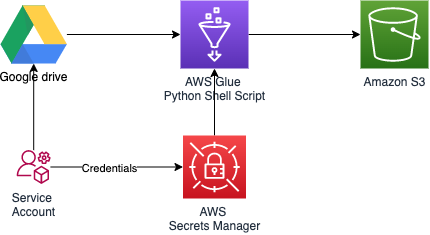
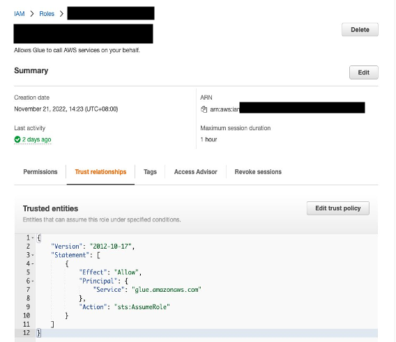

# Import Google Spreadsheets Data into Amazon S3 Files

## Motivation

This repository provides a tutorial on how to use [AWS Glue for Python Shell](https://aws.amazon.com/blogs/big-data/aws-glue-python-shell-now-supports-python-3-9-with-a-flexible-pre-loaded-environment-and-support-to-install-additional-libraries/) to access your Data in Google Spreadsheet and import it to your Amazon S3 bucket. 

## Architecture

<!--  -->
[]()

##  Project steps

Follow the steps to copy Google Spread Sheet files from your Google Drive to your Amazon S3 bucket with AWS Glue for Python Shell.

### Create Google Service Account

1. Create a Google project in GCP console and a `Service Account` associated.

Go to [cloud.google.com](cloud.google.com) and create a new Google Cloud project. Provide a `Project Name` and `Unique ID`.


[]()

2. Enable the API's for this project. 

Choose `APIs & Services` from the left menu and click on `Enable APIs and Services` to enable the Google API's.

APIs:
- `Drive`
- `Spreadsheet`


[]()

3. Create a `Service Account` for this project. 

In the `APIs & Services` section, click on `Credentials`, click on `Create credentials` and `Service Account`. 

Provide the following information: 
- Assign a name 
- modify the ID accordingly 
- insert a description. 


[]()


4. Once the `Service Account` is created, assign a private key file associated to this service account.  

In the Cloud Console, go to `IAM and Admin > Service accounts`. 

* Click the email address of the service account. 
* Click the `Keys` tab. 
* Click the `Add key` drop-down menu
* Select `Create new key`
* Select `JSON` as the Key type and 
* Click Create. 

**It downloads a JSON file**

[]()

5. Finally, navigate to your google drive folder and share the folder or files you would like to explore with the email address of the `Service Account`. 

### Create an Amazon S3 bucket
Create an Amazon S3 bucket to save the data you are consuming from Google Drive. 

Navigate to [Amazon S3 Console](https://s3.console.aws.amazon.com/s3/home) and [create a bucket](https://docs.aws.amazon.com/AmazonS3/latest/userguide/create-bucket-overview.html). 

### Store Credentials in AWS Secrets Manager

Copy the credentials JSON file in `AWS Secrets Manager` as a key/value object. 

1. Open [Secrets Manager console](https://console.aws.amazon.com/secretsmanager/home) and `Store a new secret`. 

2. Choose the option `other type of secret` and paste your `JSON` object in plain text and assign a name.


[]()

**Copy the python snippet to retrieve the secret within a python routine**

[]()

### Setup AWS IAM Role for AWS Glue, AWS Secrets Manager, and Amazon S3

Create an `IAM role` to execute the necessary operations:


1. Navigate to [IAM Console](https://us-east-1.console.aws.amazon.com/iamv2/home) and click `Roles`. 

2. Create `Role` and choose `Glue` in other AWS services.

[]()

3. Create a new custom policy for this role. Chose `JSON`tab to edit your policy and [Use this policy file](./src/policy.json) to attach the minimum necessary permissions. Remember to modify the policy with your resources values. 

[]()
[]()

These are the necessary permissions to run the job:
- Amazon S3: Read and Write
- Amazon CloudWatch: List and Write
- AWS Secrets Manager: Read

**It is recommended to attach the minimum set of permission per role** 

4. Make sure that the `Trust Policy` allows this role to assume `AWS Glue`. Click Next and assign a name to the role. 

[]()

5. Choose a name for your role. Use `gsheet-glue-role` as a suggestion.

### Create Glue Python Shell Job (Glue Interface)

The use of [AWS Glue for Python Shell](https://docs.aws.amazon.com/glue/latest/dg/add-job-python.html) makes it very easy to use python packages or environment variables. It supports Python 3.9 with a flexible pre-loaded environment and support to import additional libraries, see this [AWS Blog Post](https://aws.amazon.com/blogs/big-data/aws-glue-python-shell-now-supports-python-3-9-with-a-flexible-pre-loaded-environment-and-support-to-install-additional-libraries/) for more information about this feature. Additionally, it can be also setup to be used either programmatically with AWS CLI or through its user interface. 

1. Navigate to [AWS Glue console](https://us-east-1.console.aws.amazon.com/glue/home?region=us-east-1).
2. Choose `AWS Glue Studio - Jobs`. 
3. Select `Python Shell script Editor`.
4. Create a new job. 

[]()

5. Modify the job title and copy the [script](./src/DataPullGdrive.py). 

```python
"""
Copyright Amazon.com, Inc. or its affiliates. All Rights Reserved.
SPDX-License-Identifier: MIT-0
"""
import sys
import logging
import pandas as pd
import json
from datetime import datetime
from os.path import join
import awswrangler as wr
import boto3
from awsglue.utils import getResolvedOptions
from googleapiclient.discovery import build
from google.oauth2 import service_account

# start your logging session
logger = logging.getLogger()
logger.setLevel(logging.INFO)

# Collect your script variables
args = getResolvedOptions(sys.argv,
                          ['google_secret_name',
                           'google_secret_region',
                           'google_spreadsheet_id',
                           'google_spreadsheet_tab',
                           'bucket',
                           'folder',
                           'filename',
                           'output_format',
                           'compression']
                          )


# convert param to boolean
def str_to_bool(val):
    return val.lower() in ['true', '1', 't', 'y', 'yes']


# Method to save data in Amazon S3 Bucket
def save_file(df, bucket, folder='data',
              filename='filename', output_format='csv',
              compression=False):
    """
    Save your pandas dataframe in your Amazon S3 bucket.   
    This method requires df and bucket as mandatory variables.
    Provide the rest of variables as job parameters or use the default values.
    
    Modify the script to handle more text file separators.
    Extend the script to include more compression algorithms.
    
    Include the subfolder structure directly in your job variable folder.
    Use the following pattern: folder/subfolder1/subfolder2/...
    """
    # Create the file path with bucket, folder and filename
    subpath_args = [bucket, folder, filename]
    sub_path = '/'.join(subpath_args)
    # Add the creation time in your filename
    path_date_args = [sub_path, datetime.now().strftime('%Y_%m_%d_%H_%M_%S')]
    path_date = '_'.join(path_date_args)
    # Add the S3 url into your path
    path = 's3://'+path_date
    if output_format == 'csv':
        """
        By default this routine uses tab separator.
        Define a new job variable for different separator.
        Insert here your code to handle different types of separators
        """
        separator = '\t'
        # Add the csv file extension
        path_ext = path+'.csv'
        if (str_to_bool(compression)):
            # Include your logic to handle more compression algorithms
            """
            Insert here your code to apply more textfile compression methods.
            """
            comp_opts = 'zip'
            # Add the compression to your filename
            path_ext = path_ext+'.'+comp_opts
        else:
            comp_opts = None
        # Save your file with awswrangler package
        wr.s3.to_csv(
            df=df,
            path=path_ext,
            compression=comp_opts,
            index=False
        )
    else:
        # Add the parquet file extension
        path_ext = path+'.parquet'
        if (str_to_bool(compression)):
            """
            Insert here your code to apply more Parquet compression methods.
            """
            comp_opts = 'snappy'
            # Add the compression to your filename
            path_ext = path_ext+'.'+comp_opts
        else:
            comp_opts = None
        # Save your file with awswrangler package
        wr.s3.to_parquet(
            df=df,
            path=path_ext,
            compression=comp_opts,
            index=False
        )
    return


# Retrieve credentials from AWS Secrets Manager
# replace this value with your secret name
secret_name = args['google_secret_name']
region_name = args['google_secret_region']  # modify to your region
session = boto3.session.Session()
client = session.client(
    service_name='secretsmanager',
    region_name=args['google_secret_region']
)

get_secret_value_response = client.get_secret_value(
    SecretId=args['google_secret_name']
)

secret = get_secret_value_response['SecretString']
secret = json.loads(secret)

# Create credentials object with google.oauth2.
# Use those scopes for to connect to Google Drive.
# More information:
# https://google-auth.readthedocs.io/en/master/reference/google.oauth2.service_account.html
credentials = service_account.Credentials.from_service_account_info(
    secret,
    scopes=['https://www.googleapis.com/auth/drive', 'https://www.googleapis.com/auth/spreadsheets'])

# Open connection with googleapiclient and create object connection.
# More information: https://developers.google.com/sheets/api/quickstart/python
service = build('sheets', 'v4', credentials=credentials)
sheet = service.spreadsheets()

# Read google object
# More information:
# https://developers.google.com/sheets/api/reference/rest/v4/spreadsheets.values/get
result = sheet.values().get(
                       spreadsheetId=args['google_spreadsheet_id'],
                       range=args['google_spreadsheet_tab']).execute()
data = result.get('values')

# save data into a dataframe
data = pd.DataFrame(data[1:], columns=data[0])
bucket = args['bucket']
folder = args['folder']
filename = args['filename']
output_format = args['output_format']
compression = args['compression']
save_file(data, bucket, folder, filename, output_format, compression)

```

This code imports native Google libraries:
- [google-api-python-client](https://github.com/googleapis/google-api-python-client) → Native Google client python package
- [google-auth-oauthlib](https://github.com/googleapis/google-auth-library-python-oauthlib) → Native Google Auth python package
- [google-auth-httplib2](https://github.com/googleapis/google-auth-library-python-httplib2) → This library provides an httplib2 transport for google-auth.
- [fastparquet](https://github.com/MrPowers/fastparquet) → parquet support for pandas


**You can refer to their documentation to extend the proposed code sample.**


6. Setup the job parameters. 

Follow the Glue interface, and provide the following information:
 
- IAM Role: You can provide the glue role that we have created before. 
- Python version: Python 3.9
- Data Processing: 1/16 DPU
- Number of retries: 1
- Job Timeout: 2880 min

You can keep advance properties as per default. 

The code uses a set of script variables to easily integrate with your pipeline. In Job parameters, add all the additional python modules imported and the environment variables. To do that include the following job parameter in key-value format:
- --additional-python-modules : google-api-python-client, google-auth-oauthlib, google-auth-httplib2, fastparquet
- --google_secret_name: your-google-secret-name
- --google_secret_region: your-google-secret-region
- --google_spreadsheet_id: your-google-spreadsheet-id (More information [here](https://developers.google.com/sheets/api/guides/concepts))
- --google_spreadsheet_tab: your-google-spreadsheet-tab
- --bucket: your-data-bucket
- --folder: your-data-bucket-folder (default = data)
- --filename: your-data-filename (default = filename)
- --output_format: your-filename-format (supported file formats: parquet and csv tab separated)
- --compression: your-filename-compression (supported compression algorithms: snappy for parquet and zstd for csv)


[]()


[]()


[]()


### Create Glue Python Shell Job (AWS CLI)
In case you would prefer to use `AWS CLI` to create your `Glue Job` follow those steps: 

1. Save the [code sample](./src/DataPullGdrive.py) file in a `S3 Bucket`. (Reuse the Bucket you have created before or create new one)
2. Open your preferred `shell` terminal with configured `AWS CLI` access to your account. 
3. Execute the following bash command:

```bash
aws glue create-job --profile account-session #Choose the profile that enables access to your account
--name google_spreadsheet_data #Choose a unique name for this job
--role gsheet-glue-role #Choose teh Role created in previous sections
--command 
Name=pythonshell, 
PythonVersion=3.9, 
# Navigate to your python script in S3. Create a new bucket or reuse the existent one. 
# Chose a your strategy for the TempDir location in --default-arguments
ScriptLocation=s3://bucket/script_folder/script.py 
--default-arguments 
'{
    "--TempDir":"s3://${temp_bucket}/${temp_folder}", 
    "--job-language":"python",
    "library-set":"analytics",
    "--additional-python-modules":"google-api-python-client, google-auth-oauthlib, google-auth-httplib2, fastparquet"
    "--google_secret_name":"${your-google-secret-name}"
    "--google_secret_region":"${your-google-secret-region}"
    "--google_spreadsheet_id":"${your-google-spreadsheet-id}"
    "--google_spreadsheet_tab":"${your-google-spreadsheet-tab}"
    "--bucket":"${your-data-bucket}"
    "--folder":"${your-data-bucket-folder}"
    "--filename":"${your-data-filename}"
    "--output_format":"${your-filename-format}"
    "--compression":"${your-filename-compression}"
}'
--timeout 30 
--max-capacity 0.0625
--max-retries 1
```
### Run the Job

Once you have finished the setup you can run the `Glue Job` in both `AWS Glue interface` or in `AWS CLI`. 

- Interface:
[]()

- AWS CLI:

```bash
aws glue start-job-run --job-name google_spreadsheet_data
```

## Clean up
AWS Glue is a fully managed service and you will not incur in extra charges if you do not run your jobs. However, to avoid any additional charges linked to other services follow these steps:
- [Empty](https://docs.aws.amazon.com/AmazonS3/latest/userguide/empty-bucket.html) and [delete](https://docs.aws.amazon.com/AmazonS3/latest/userguide/delete-bucket.html) the S3 bucket.
- [Delete Google Service Account credentials](https://docs.aws.amazon.com/secretsmanager/latest/userguide/manage_delete-secret.html) in AWS Secrets Manager .

## (Optional) For local testing
In case you want to try the code locally or you would like to add new capabilities to this routine, we recommend to test it locally. Use your preferred code IDE with the same `JSON` credentials file you have created previously and make any  enhancements that applies to your use case. Once you are satisfied with your code follow the steps in this tutorial with your new routine. 

Run the following terminal command to clone the repo:
```bash
git clone http://...
cd <folder>
```
Navigate to your python environment and run the following command to install the [requirements](requirements.txt).

```
pip install -r requirements.txt
```

## Contributing
See [CONTRIBUTING](CONTRIBUTING.md) for more information.

## License
This library is licensed under the MIT-0 License. See the [LICENSE](LICENSE.md) file.
